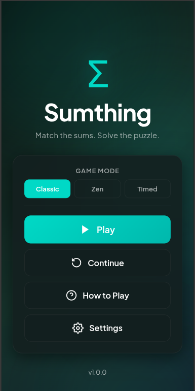
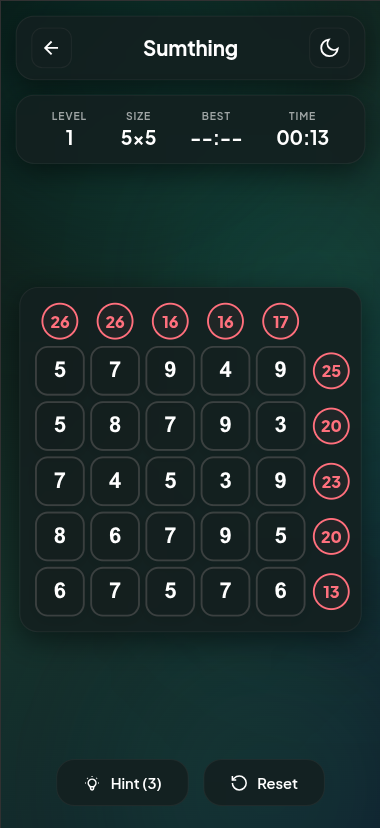
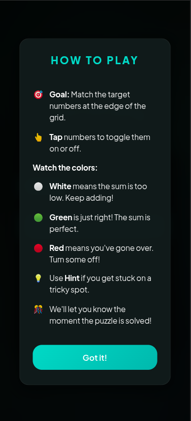
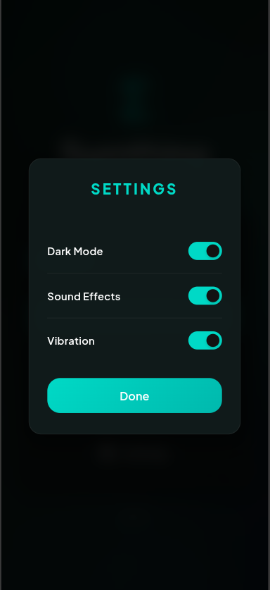

# Σ Sumthing - Math Puzzle Game

[](https://opensource.org/licenses/ISC)
[](https://www.android.com/)
[](https://capacitorjs.com/)

**Sumthing** is a beautiful, calm, and modern math puzzle game built with HTML, CSS, and Javascript, powered by Capacitor for a native mobile experience.

## ✨ Features
- **Three Game Modes**: Classic, Zen (No Timer), and Timed.
- **Dynamic Difficulty**: Grid sizes increase from 5x5 up to 8x8 as you progress.
- **Modern Aesthetics**: Glassmorphism UI, smooth micro-animations, and floating background shapes.
- **Adaptive Themes**: Seamless Dark and Light mode support.
- **Audio Experience**: Procedural ambient music and satisfying sound effects.
- **Offline First**: Works fully offline with Service Worker support.

## 📱 Screenshots

| Menu | Gameplay | How to Play | Settings |
| :---: | :---: | :---: | :---: |
|  |  |  |  |

## 🛠️ Tech Stack
- **Frontend**: Vanilla HTML5, CSS3 (Modern Variables & Grid), ES6 Javascript.
- **Mobile Bridge**: [Capacitor](https://capacitorjs.com/) (Cross-platform).
- **Icons**: Custom Sigma Symbol branding.

## 🚀 Quick Start for Developers

### 1. Prerequisites
- **Node.js** installed.
- **Java 11** (Required for the current Android build).
- **Android Studio** for mobile deployment.

### 2. Installation
```bash
git clone https://github.com/YOUR_USERNAME/sumthing.git
cd sumthing
npm install
```

### 3. Build & Run
To compile the web assets and sync with the Android project:
```bash
# Sync web changes to Android
npx cap copy android

# Open in Android Studio
npx cap open android
```

## 📖 Build Guide
For detailed instructions on building APKs and deploying to the Google Play Store, see [MOBILE_BUILD_GUIDE.md](MOBILE_BUILD_GUIDE.md).

## 📄 License
This project is licensed under the ISC License.
